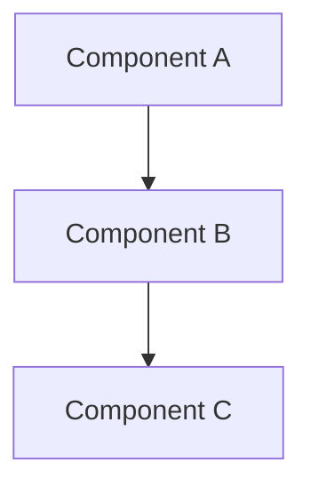

# Architecture Overview

Define the systems, data contracts, and mathematical models here.

!!! info "Architectural Context"
    Provide high-level context for the system architecture. This section should address the "Why" behind the structural decisions.

## System Topology

## Mathematical Model
Define the core logic using LaTeX notation:
$$X(t+1) = X(t) + \Delta X \cdot \omega$$

## Core Specifications
- [**Specification 1**](index.md): Detailed description of the protocol or data contract.
